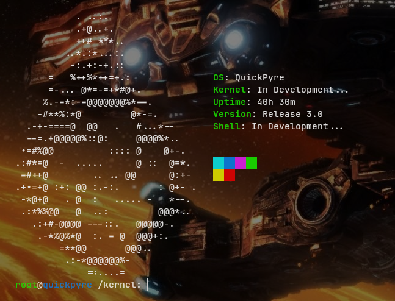
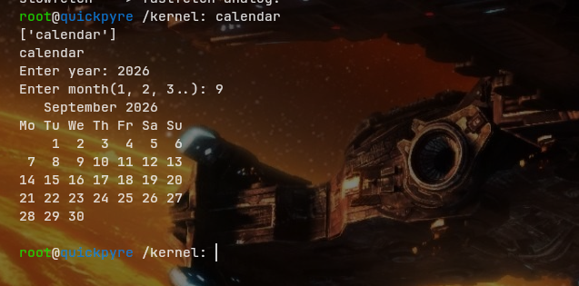
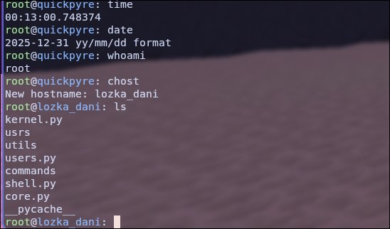

## Hello!
Hello! My name is Danila, and i am a creator of this very bad pseudo python os.

# Release 3.0!

### Prerequisites

List any prerequisites, libraries, OS versions, etc., needed before installation.

*   `only base python libraries(tk, os, Path, etc.)`

### Installation

A step-by-step series of examples that tell you how to get a development environment running.

1.  Clone the repo:
    ```bash
    git clone https://github.com/LozkaDani/QuickPyre.git
    ```
2. Cd to project's path:
   ```bash
   cd QuickPyre
   ```

3. Cd to kernel:
    ```bash
    cd kernel
    ```
4. Run core.py:
   ```bash
   python shell.py
   ```   

### ChangeLog
Full changelog for release 3.0.

**Package manager and apps**
1. Added the quick package manager (-S install, -R remove, -s/--search search); I'll write a guide on how to add a program to the quick repo later.
2. Removed the slowfetch hardcode from the kernel — apps from apps/ are now launched dynamically via run_app instead of being imported in kernel.py.
3. Added the ability to run an arbitrary file by path via exec_app.
4. Aliases of installed programs are stored in ~/.program_aliases.

**New commands**
5. rm — remove files and directories.
6. touch — create new files.
7. su — switch user without restarting.
8. history — view command history with date and time.
9. clear_history — clear the history.

**Kernel and shell**
10. Added command history saving to config/history.quickhist.
11. Added autostart of programs after login via ~/.kvalxarc (utils/autostart.py).
12. Added flag parsing in check_cmd; ls now supports the -t flag (file modification time).
13. echo can now write to a file via > (completely overwrites the file).
14. The prompt now shows the current path; added a branch for Windows (os.name == "nt").

**Other**
15. Added docstrings in kernel.py, will roll them out to all files in 3.1-3.3.

ChangeLog by Koda AI.
    

## Screenshots

<html></html>
<html></html>
<html></html>
