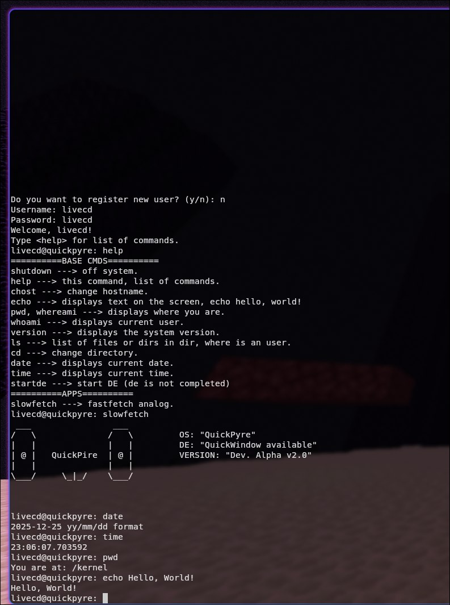

## Hello!
Hello! My name is Danila, and i am a creator of this very bad pseudo python os.

### Prerequisites

List any prerequisites, libraries, OS versions, etc., needed before installation.

*   `only base python libraries(tk, os, Path, etc.`

### Installation

A step-by-step series of examples that tell you how to get a development environment running.

1.  Clone the repo:
    ```bash
    git clone https://github.com/LozkaDani/QuickPyre.git
    ```
2. Cd to project's path:
   ```bash
   cd QuickPyre
   ```

3. Cd to kernel:
    ```bash
    cd kernel
    ```
4. Run core.py:
   ```bash
   python core.py
   ```   
    

## Screenshots

<html></html>
